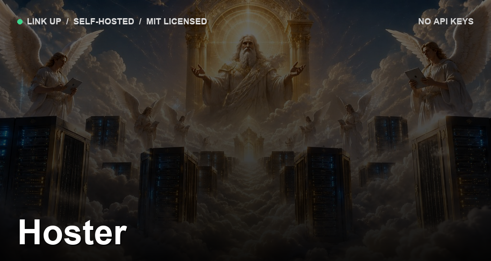

<p align="center">
  
</p>

# Hoster

**Your machine as a hosting platform — no cloud, no accounts, no monthly bill.**

Point it at a project folder. It detects the stack, builds it, runs it, gives it a
Postgres database, and puts it behind a URL. Front-end and back-end both. Works on
your LAN with no internet at all.

<p align="center">
  
  
  
  
  
</p>

```bash
hoster deploy ./my-app
# → http://my-app.hoster.localhost

hoster share my-app
# → public HTTPS URL (Cloudflare quick tunnel)
```

**Full install & ops:** see **[docs/SETUP.md](docs/SETUP.md)**.

---

## Features

- **Auto-detects the stack** — Dockerfile → [Nixpacks](https://nixpacks.com) (Node, Python, Go, Ruby, Rust, PHP, Java) → static files
- **Front-end frameworks** — React, Vue, Svelte, Angular build to assets with SPA routing fallback
- **Postgres per app** — created on first deploy, injected as `DATABASE_URL`
- **Per-app environment** — set vars in the dashboard Settings panel (applied on redeploy)
- **HTTPS on your LAN** — Caddy’s internal CA
- **Public share on demand** — Cloudflare quick tunnel; no port forwarding or domain required
- **Survives reboots** — apps restart when you log in
- **Dashboard + CLI** — same capabilities either way

## Quick start

```bash
# 1. Prerequisites (macOS)
brew install node docker nixpacks cloudflared
# Start Docker Desktop and wait until it is running.

# 2. Install Hoster
git clone https://github.com/aidnhealth/Hoster.git
cd Hoster
npm install
npm link          # puts `hoster` on your PATH

# 3. Start the control plane
npm start
# Dashboard → http://localhost:7010
```

Deploy from the dashboard (Browse… → Deploy) or the CLI:

```bash
hoster deploy /absolute/path/to/your-app
hoster ls
```

For LAN DNS (`*.hoster.local`), start-on-login, env vars, troubleshooting, and
architecture details, follow **[docs/SETUP.md](docs/SETUP.md)**.

## CLI

| Command | Description |
|---|---|
| `hoster deploy <path> [--name slug]` | Build and publish |
| `hoster ls` | List apps and URLs |
| `hoster logs <slug>` | Show logs |
| `hoster share <slug>` | Open a public tunnel |
| `hoster unshare <slug>` | Close the tunnel |
| `hoster stop \| start <slug>` | Stop or start |
| `hoster rm <slug>` | Remove app, container, and database |

## Reaching apps

| Where | Internet | How |
|---|---|---|
| This Mac | No | `http://<slug>.hoster.localhost` |
| Same Wi‑Fi | No | LAN URL on the app card (`http://<lan-ip>:<port>`) |
| Internet | Yes | `hoster share <slug>` |
| Offline + remote | — | Not possible |

## Database

Every container app receives `DATABASE_URL`:

```js
const { Pool } = require('pg');
const pool = new Pool({ connectionString: process.env.DATABASE_URL });
```

## Security

Built for a **trusted operator** on their own machine. Deploys run build scripts
locally; public share has no auth. Secrets live in `~/.hoster/secrets.json`
(`0600`). See [SECURITY.md](SECURITY.md).

## Limits

- Tunnel URLs change on each share/restart (stable domains need a named tunnel)
- Control plane is unauthenticated — keep port `7010` on localhost
- `hoster rm` drops the app database with no undo
- Apps capped at 1 GB RAM / 1.5 CPUs
- macOS only for now

## Contributing

See [CONTRIBUTING.md](CONTRIBUTING.md).

## License

[MIT](LICENSE) © Rahul Abhishek S
